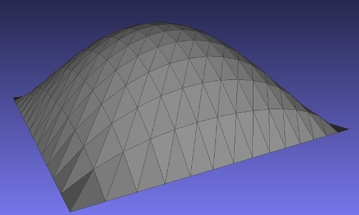

## FEM application

This provides a gentle introduction to the use of simit for finite element
computations. The core idea is to use the C++ files for pre- and post-processing
while letting the assembly and solvers be done by the simit program. It consists
of three functions, one for mesh generation, one for result-dumping and one
main method. While both mesh generation and visualization can be handled by
the simit core, we use custom tailored solutions here for clarity, and to
make the examples more self-contained.

## 2D FEM setup

`static_scalar_2D.cpp` provides a minimalistic framework for a 2D finite element
solver. It creates a uniform mesh of triangles on which to run a simit-program on,
followed by writing the results as a surface plot in stl-format. It will only
work for scalar equations with one unknown "u".

## 3D FEM setup

`static_scalar_3D.cpp` provides a minimalistic framework for a 3D finite element
solver. It creates a uniform mesh of tetrahedrals on which to run a simit-program on,
followed by writing the results as a volumetric scalar field in vtk-format.

### Poisson 
`poisson_2D_triangles.sim` and `poisson_3D_tetrahedrons.sim` will solve the
poisson-problem with a constant right-hand side and homogenuous (zero) boundary
conditions. It results in a "bubble"-ish functions as output.

### Deprecated
fem.cpp is considered unstable, and is kept for legacy purposes. Might revive
it at some later point
